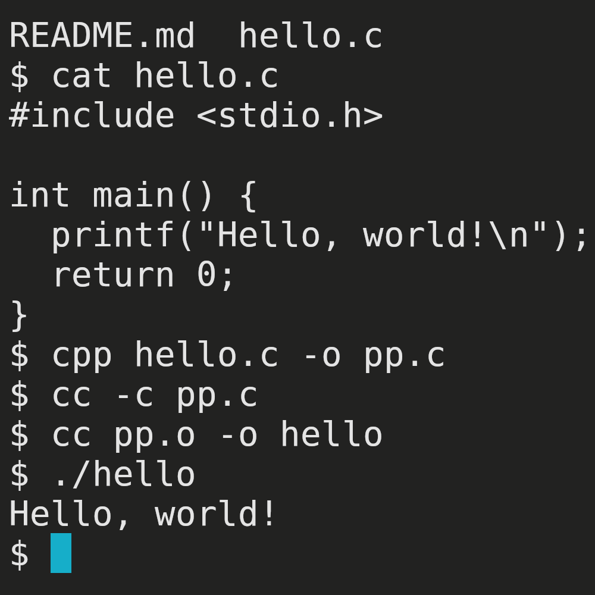

# Лабораторная работа №0
## Задание
Написать свою первую программу на C. Компилировать её поэтапно (каждый этап отдельно).
## Проделанная работа
1. Написан файл "hello.c", содержащий программу "Hello, world!".
2. Запущен препроцессор: "cpp hello.c -o pp.c"
3. Запущен компилятор, получен объектный файл: "cc -c pp.c"
4. Запущен сборщик, получен исполняемый файл: "cc pp.o -o hello"
## Скриншоты

## P.S.
Слава каноническому POSIX!
