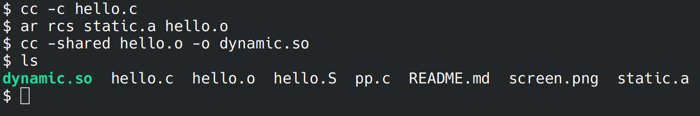

# Лабораторная работа №0
## Задание
Написать свою первую программу на C. Компилировать её поэтапно (каждый этап отдельно).

На максимальную сложность: соберите для своей программы 2 библиотеки - статическую и динамическую.
## Проделанная работа
1. Написан файл "hello.c":
```c
#include <stdio.h>

int main() {
  printf("Hello, world!\n");
  return 0;
}
```
2. Запущен препроцессор: "cpp hello.c -o pp.c"
3. Запущен компилятор, получен файл на языке ассемблера: "cc -S pp.c -o hello.S"
4. Запущен ассемблер, получен объектный файл: "as hello.S -o hello.o"
5. Запущен сборщик, получен исполняемый файл: "cc hello.o -o hello"

На максимальную сложность:
```sh
cc -c lib.c
ar rcs static.a lib.o # статическая библиотека; файл "static.a"
cc -shared lib.o -o dynamic.so # динамическая библиотека; файл "dynamic.so"
cc main.c static.a -o static
cc main.c dynamic.so -o dynamic
```

## Скриншот



## P.S.
Слава каноническому POSIX!
