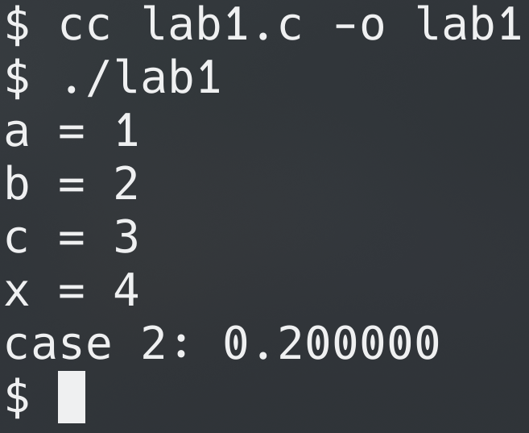
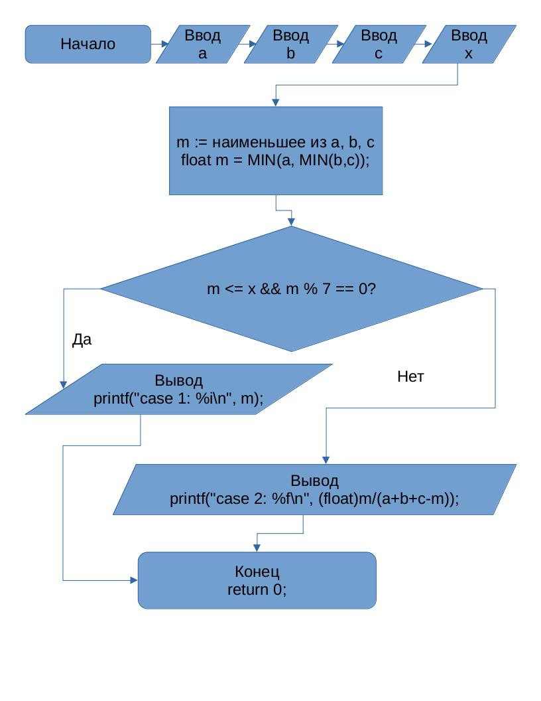

# Лабораторная работа №1

## Вариант 3
## Задание
1. Разобрать код программы из примера
2. Составить блок-схему алгоритма
```Вывести значение наименьшего из трёх параметров $a$, $b$, $c$ если оно меньше или равно $x$ и кратно 7, и частное наименьшего параметра и суммы двух оставшихся иначе.```
3. Написать программу, решающую задачу по алгоритму из предыдущего пункта (она в `lab1.c`)
4. Оформить отчёт в `README.md` (это он)
5. Сложность "Well-done": реализовать “защиту от дурака” – обработайте пользовательский ввод таким образом, чтобы выполнение алгоритма программы невозможно было нарушить некорректным пользовательским вводом.

## Программа
```c
#include <stdio.h>
#define MIN(A, B) (A < B ? A : B)

int main() {
    int a, b, c, x;
    printf("a = "); scanf("%i", &a);
    printf("b = "); scanf("%i", &b);
    printf("c = "); scanf("%i", &c);
    printf("x = "); scanf("%i", &x);
    int m = MIN(a, MIN(b, c));
    if(m <= x && m % 7 == 0) printf("case 1: %i\n", m);
    else {
        if(a+b+c-m == 0) {
            printf("сработала защита от дурака\n");
            return 1;
        }
        printf("case 2: %f\n", (float)m/(a+b+c-m));
    }
    return 0;
}
```

## Скриншот


## Блок-схема

