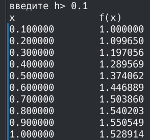
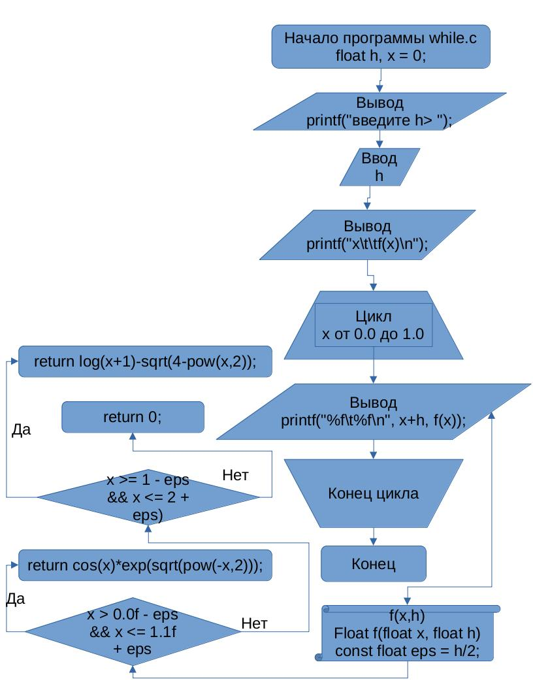
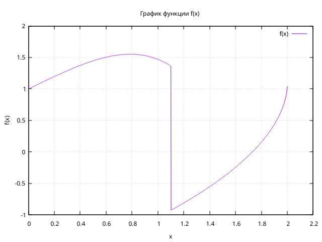
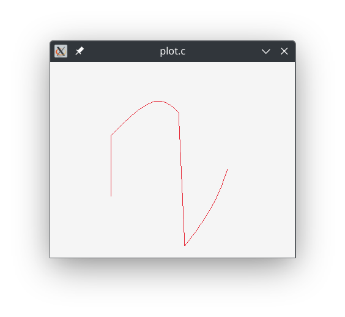

# Лабораторная работа №2
## Вариант 3
## Задание
- Напишите программу по варианту, используя оператор цикла while.
- Напишите программу, используя оператор цикла for.
- Постройте график с использованием gnuplot.
- Составьте блок-схемы.
- Оформите отчёт в README.md. Отчёт должен содержать:
1. Задание
2. Описание проделанной работы
3. Скриншоты результатов
4. Блок-схемы
5. График функции
6. Ссылки на используемые материалы

Максимальная сложность: самостоятельно реализуйте построение графика с использованием любой графической библиотеки (sdl, raylib, opengl и т.д.)

Программа должна выводить на экран таблицу вида:

|$x$       |  $f(x)$  |
|----------|----------|
|0.000000  |  0.123456|
|0.100000  |  1.234567|
|0.200000  |  2.345678|
|...       |  ...     |
|1.000000  |  3.456789|

Шаг $h$ изменения аргумента $x$ необходимо ввести с клавиатуры. Программа должна корректно выводить точки для любого положительного значения $h$.

Функция из варианта 3:

$$
f(x) =
  \begin{cases}
    cos(x)e^{-x^2} \text{,}       & 0 \leq x \leq 1 \text{;} \\
    ln(x+1)-\sqrt{4-x^2} \text{,} & 1 < x \leq 2 \text{.}
  \end{cases}
$$

## Проделанная работа
1. Написана программа с использованием цикла $while$ (while.c):
```c
#include <stdio.h>
#include <math.h>

float f(float x, float h) {
    const float eps = h/2;
    if(x > 0.0f - eps && x <= 1.1f + eps)
      return cos(x)*exp(sqrt(pow(-x,2)));
    else if(x >= 1 - eps && x <= 2 + eps)
      return log(x+1)-sqrt(4-pow(x,2));
    return 0.0f;
}

int main() {
    float h, x = 0;
    printf("введите h> "); scanf("%f", &h);
    printf("x\t\tf(x)\n");
    while(x <= 2.0f) {
        printf("%f\t%f\n", x+h, f(x, h));
        x += h;
    }
    return 0;
}

```
2. Цикл $while$ заменён на цикл $for$ (for.c):
```c
#include <stdio.h>
#include <math.h>

float f(float x, float h) {
    const float eps = h/2;
    if(x > 0.0f - eps && x <= 1.1f + eps)
      return cos(x)*exp(sqrt(pow(-x,2)));
    else if(x >= 1 - eps && x <= 2 + eps)
      return log(x+1)-sqrt(4-pow(x,2));
    return 0.0f;
}

int main() {
    float h;
    printf("введите h> "); scanf("%f", &h);
    printf("x\t\tf(x)\n");
    for(float x = 0; x <= 2.0f; x += h)
        printf("%f\t%f\n", x+h, f(x));
    return 0;
}
```
Вывод обеих программ совпал.

3. Сделан скриншот:



4. Сделана блок-схема программ (т.к. программы различаются только синтаксически, их блок-схемы я свёл к одной):



5. Сделан график функции в gnuplot (файлы plot.gpi, my_graph.txt):



6. Написан файл "plot.c" на основе "for.c" для реализации построения графиков через raylib:
```c
#include <stdio.h>
#include <math.h>
#include <raylib.h>

float f(float x, float h) {
    const float eps = h/2;
    if(x > 0.0f - eps && x <= 1.1f + eps)
        return cos(x)*exp(sqrt(pow(-x,2)));
    else if(x >= 1 - eps && x <= 2 + eps)
        return log(x+1)-sqrt(4-pow(x,2));
    return 0.0f;
}


#define W 400
#define H 320

#define OX 100
#define OY H-120
#define SCALE 100

int main() {
    InitWindow(W, H, "plot.c");
    float h;
    //printf("введите h> "); scanf("%f", &h);
    h = 0.1;
    printf("x\t\tf(x)\n");
    //for(float x = 0; x <= 2.0f; x += h)
    //    printf("%f\t%f\n", x+h, f(x, h));
    SetTargetFPS(30);
    while(!WindowShouldClose()) {
        BeginDrawing();
        ClearBackground(RAYWHITE);
        int prevX = 0, prevY = f(0, h)*SCALE;
        for(float x = 0+h; x <= 2.0f; x += h) {
            int tX = x*SCALE;
            int tY = f(x, h)*SCALE;
            DrawLine(OX+prevX, OY-prevY, OX+tX, OY-tY, RED);
            prevX = tX;
            prevY = tY;
        }
        EndDrawing();
    }
    CloseWindow();
    return 0;
}
```

7. Собран, запущен, сделан снимок экрана:



## Ссылки на используемые материалы
https://en.wikibooks.org/wiki/LaTeX/Mathematics

https://www.raylib.com/cheatsheet/cheatsheet.html
