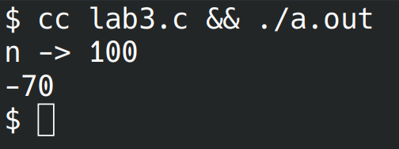

# Лабораторная работа №3
## Вариант 3
## Задание
1. Напишите программу по своему варианту.
2. Оформите отчёт в README.md. Отчёт должен содержать:
- Задание
- Описание проделанной работы
- Скриншоты результатов
- Ссылки на используемые материалы
3. Сложность "Well-done": заменить в программе массив на связный список собственной реализации, позволяющий хранить данные любого типа

Задание по варианту:
- Найти три максимума в массиве и записать разность их произведения и суммы их индексов по модулю $n$, где $n$ - количество элементов массива.

## Требования и ограничения
Количество элементов массива вводить с клавиатуры, массив заполнить случайными числами. Необходимые расчёты и модификации реализовать в виде функций.

## Проделанная работа
1. Написан файл "lab.c":
```c
#include <stdio.h>
#include <stdlib.h>
#include <time.h>

// что называется "tagged union"
typedef struct Data {
    enum {INT, FLOAT, DOUBLE, VOIDP} tag; // и т.д.
    union {
        int i; float f; double d; void *voidp;
    } d; // тоже можно добавить значений
    // кстати, остальные значения можно писать/читать,
    // даже не имея для них специального тега путём
    // кастования указателя на пустоту
} Data;

// однонаправленный список
typedef struct List {
    Data data;
    struct List *next;
} List;

// не очень эффективно, но это же просто лаба :)
void list_append(List *l, const Data d) {
    while(l->next != NULL)
        l = l->next;
    l = malloc(sizeof(List));
    *l = (List){d, NULL};
}

Data list_get(List *l, int i) {
    // если будет передан out-of-bounds индекс, то программа вылетит
    while(i-- > 0)
        l = l->next;
    return l->data;
}

void fill(int n, List *l) {
    printf("fill(%i, &l):\n", n);
    for(int i = 0; i < n; ++i) {
        int n = (rand() % 101) - 50;
        printf("%i: %i\n", i, n);
        *l = (List){(Data){.tag=INT, .d.i=n}};
        l->next = malloc(sizeof(List));
        l = l->next;
    }
    l->next = NULL;
}

int compute(int n, List *l) {
    /* Найдём 3 максимума и их индексы */
    int M[3] = {-9999, -9999, -9999}, I[3];
    List *p = l;
    for(int i = 0; i < n; ++i) {
        if(p->data.d.i > M[0]) {
            M[0] = p->data.d.i;
            I[0] = i;
        }
        p = p->next;
    }
    p = l;
    for(int i = 0; i < n; ++i) {
        if(i == I[0]) {
            p = p->next;
            continue;
        }
        if(p->data.d.i > M[1]) {
            M[1] = p->data.d.i;
            I[1] = i;
        }
        p = p->next;
    }
    p = l;
    for(int i = 0; i < n; ++i) {
        if(i == I[0] || i == I[1]) {
            p = p->next;
            continue;
        }
        if(p->data.d.i > M[2]) {
            M[2] = p->data.d.i;
            I[2] = i;
        }
        p = p->next;
    }
    printf("compute(): 3 максимума: %i, %i, %i\n", M[0], M[1], M[2]);
    printf("compute(): их индексы: %i, %i, %i\n", I[0], I[1], I[2]);
    return M[0]*M[1]*M[2] - ((I[0]+I[1]+I[2]) % n);
}

int main() {
    srand(time(NULL));
    List l; // выделяю на стеке (эффективнее, чем malloc)
    int n;
    printf("n -> ");
    scanf("%d", &n);
    fill(n, &l);

    printf("%i\n", compute(n, &l));
    return 0;
}
```
2. Скомпилирован и запущен
3. Сделан скриншот:



## Ссылки на используемые материалы
https://evil-teacher.on.fleek.co/prog_pm/term1/lab03/
