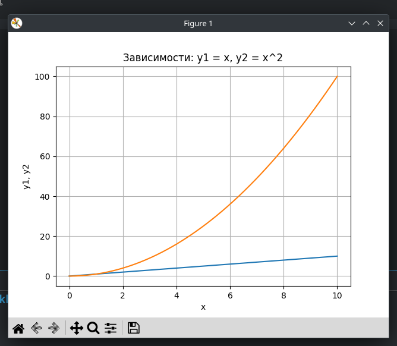
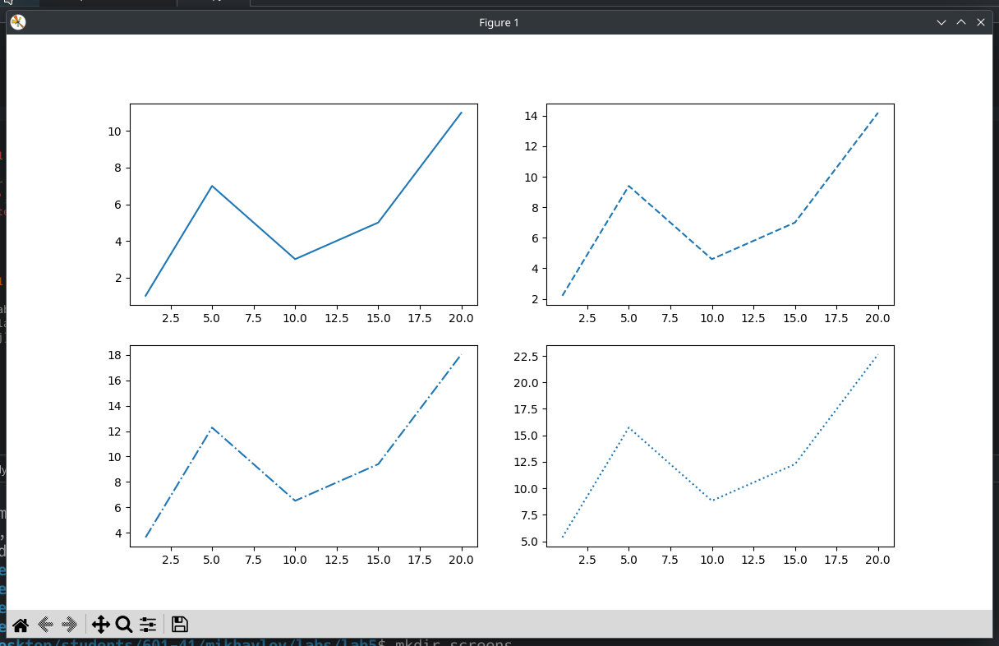
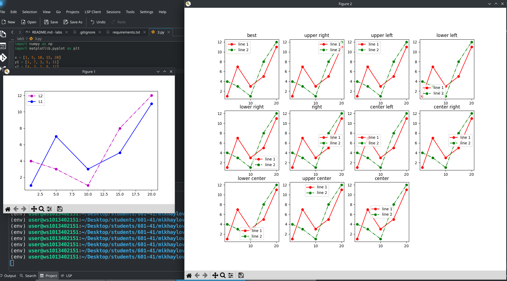
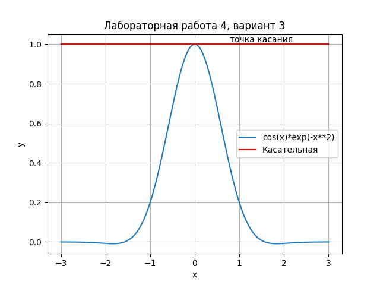
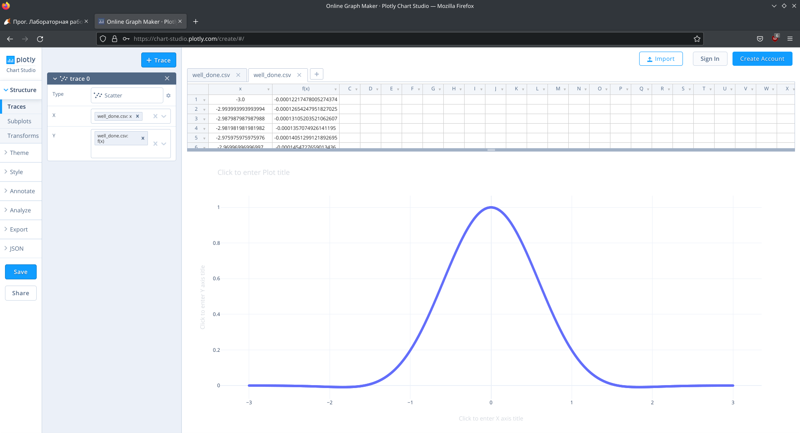

# Лабораторная работа №5
## Уроки из книги
### 1

### 2

### 3

## График функции из своего варианта (вариант 3)
$$
f(x) = cos(x)e^{-x^2}
$$
```python
import matplotlib.pyplot as plt
import numpy as np
from math import *

# задал верхнюю часть функции из варианта 3
def f(x):
    return cos(x)*exp(-x**2)

# создал список точек от -3 до 3 (1000 точек)
x = np.linspace(-3, 3, 1000)
# список точек функции из варианта
y1 = [f(i) for i in x]
# касательная в точке 0
y2 = [1 for i in x]

# заголовок
plt.title('Лабораторная работа 4, вариант 3')
# название осей
plt.xlabel('x')
plt.ylabel('y')
# включение сетки
plt.grid()
# построение этих функций
plt.plot(x, y1, label='cos(x)*exp(-x**2)')
plt.plot(x, y2, 'r', label='Касательная')
# аннотация
plt.text(0.785, max(y1)+0.01, 'точка касания')
# легенда
plt.legend()
# вывести график
plt.show()
```


## На максимальную сложность:
```python
import matplotlib.pyplot as plt
import numpy as np
from math import *

# задал верхнюю часть функции из варианта 3
def f(x):
    return cos(x)*exp(-x**2)

# создал список точек от -3 до 3 (1000 точек)
x = np.linspace(-3, 3, 1000)

# вывод в формате CSV
print('x, f(x)')
for i in x: 
    print(i, ',', f(i))

```

```sh
python3 well_done.py > well_done.csv
```

Создал график на plotly путём импорта CSV файла (well_done.csv):



Регистрация на сайте отключена, поэтому сделать график общедоступным не могу:


