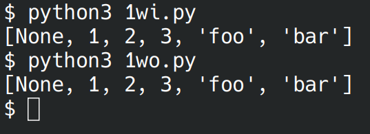

# Лабораторная работа №7
## Вариант 3
### Задача 1:
Функция для распаковки списка, содержащего другие объекты (`int`, `str`, `list`, `tuple`, `dict`, `set`) произвольной вложенности.
```python
>>> unpack([None, [1, ({2, 3}, {'foo': 'bar'})]])
[None, 1, 2, 3, 'foo', 'bar']
```

#### С рекурсией
```python
from itertools import chain
def unpack(x):
    def f(z):
        if type(z) == list:
            return list(chain.from_iterable([f(i) for i in z]))
        return [z]
    match type(x).__name__:
        case 'list' | 'tuple' | 'set':
            return f([unpack(i) for i in x])
        case 'dict':
            return [[unpack(i), unpack(x[i])] for i in x.keys()]
        case _:
            return x

print(unpack([None, [1, ({2, 3}, {'foo': 'bar'})]]))
```


#### Без рекурсии
```python
from itertools import chain
def unpack(n):
    r = []
    q = [n]
    while len(q) > 0:
        n = q[-1]
        del q[-1]
        match type(n).__name__:
            case 'list' | 'tuple' | 'set': q.extend(n)
            case 'dict':
                q.extend(list(n.keys()))
                q.extend(list(n.values()))
            case _: r.append(n)
    return r[::-1]

print(unpack([None, [1, ({2, 3}, {'foo': 'bar'})]]))
```


### Задача 2
Функция для расчёта $w_i=w_{i-1}w_{i-2}\frac{(i-1)^2}{(i+1)^3}$. $w_1=0.3,w_2=-1.5$.

#### С рекурсией
```python
def w(i):
    if i == 1: return 0.3
    if i == 2: return -1.5
    return w(i-1)*w(i-2)*(i-2)**2/(i+1)**3

for i in range(1, 10):
    print(w(i))
```


#### Без рекурсии
```python
def w(i):
    if i == 1: return 0.3
    if i == 2: return -1.5
    p = -1.5
    pp = 0.3
    for i in range(3, i+1):
        t = p*pp*(i-2)**2/(i+1)**3
        pp = p
        p = t
    return p

for i in range(1, 10):
    print(w(i))
```

