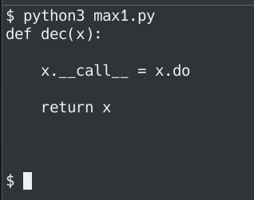
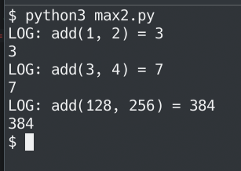

# Лабораторная работа №8
## Вариант 3

### Задача 1
Замыкание для получения очередной строки из файла.
```python
def line(fname):
    f = open(fname, 'r')
    return lambda: f.readline()

f = line('1.py')
print(f())
print(f())
print(f())
```


### Задача 2
Декоратор, который будет логировать вызовы функций.
```python
def log(f):
    def d(*args, **kwargs):
        r = f(*args, **kwargs)
        print('LOG:', f.__name__ + \
            '(' + str(args)[1:-1] + ') =', r)
        return r
    return d

def add(x, y): return x + y

f = log(add)
print(f(1, 2))
print(f(3, 4))
print(f(128, 256))
```


## На максимальную сложность

## Задача 1

```python
def dec(x):
    x.__call__ = x.do
    return x

@dec
class Line:
    def __init__(self, namepath):
        self.f = open(namepath, 'r')
    def do(self):
        return self.f.readline()

f = Line('max1.py')
print(f())
print(f())
print(f())
print(f())
```



## Задача 2

```python
def dec(x):
    x.__call__ = x.do
    return x

@dec
class Log:
    def __init__(self, f):
        self.f = f
    def do(self, *args, **kwargs):
        r = self.f(*args, **kwargs)
        print('LOG:', self.f.__name__ + \
            '(' + str(args)[1:-1] + ') =', r)
        return r

def add(x, y): return x + y

f = Log(add)
print(f(1, 2))
print(f(3, 4))
print(f(128, 256))
```


