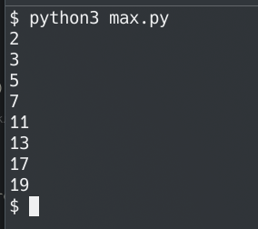

# Лабораторная работа №9
## Вариант 3
Задача: написать генератор простых чисел

## Решение
```python
# генерирует простые числа от 2 до n (включительно)
def f(n):
    def isPrime(x):
        for i in range(2, x//2+1):
            if x % i == 0: return False
        return True
    for i in range(2, n+1):
        if isPrime(i):
            yield i

for i in f(20):
    print(i)
```


## На максимальную сложность:

```python
import multiprocessing
from multiprocessing.dummy import Pool

# создал пул по количеству ядер
pool = Pool(multiprocessing.cpu_count())

# генерирует простые числа от 2 до n (включительно)
def f(n):
    def isPrime(x):
        def f(i):
            return x % i == 0
        return not any(pool.imap_unordered(f, range(2, x//2+1)))
    for i in range(2, n+1):
        if isPrime(i):
            yield i

for i in f(20):
    print(i)
```


