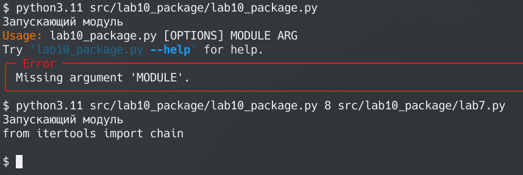

# Лабораторная работа №10
## Задание:
- Создайте пакет, содержащий 3 модуля на основе лабораторных работ №№ 7-9
- Напишите запускающий модуль на основе Typer, который позволит выбирать и настраивать параметры запуска логики из пакета.
- Оформите отчёт в README.md. Отчёт должен содержать:
-     Условия задач
-     Описание проделанной работы
-     Скриншоты результатов
-     Ссылки на используемые материалы

## Решение:
1. Создано виртуальное окружение, установлены $typer$ и $build$
2. Созданы директории src/, src/lab10_package/
3. Туда скопированы файлы из лаб 7-9
4. Написан lab10_package.py:

```python
import lab7, lab8, lab9
import typer

# параметр arg может содержать исключительно строки, т.к. передается через аргументы коммандной строки, поэтому 7 и 9 не могут нормально работать. Это можно исправить, предварительно eval код, но это не безопасно.
def main(module: str, arg):
    match module:
        case '7': print(lab7.unpack(arg))
        case '8': print(lab8.line(arg)())
        case '9': print(lab9.f(arg))
        case _: print(f"Неизвестный модуль: {module}")


if __name__ == "__main__":
    print("Запускающий модуль")
    typer.run(main)
```
5. Пакет запущен


6. Написан файл pyproject.toml:
```toml
[build-system]
requires = ["setuptools>=61.0"]
build-backend = "setuptools.build_meta"

[project]
name = "lab10_package"
version = "0.0.1"
authors = [
  { name="Anatoly Mikhaylov", email="nevazno@nevazno.com" },
]
description = "A small example package"
readme = "README.md"
requires-python = ">=3.11"
classifiers = [
    "Programming Language :: Python :: 3",
    "License :: None",
    "Operating System :: OS Independent",
]

[project.urls]
Homepage = "https://github.com/tolyprog/labs/lab10"
```
7. Пакет собран и запущен


