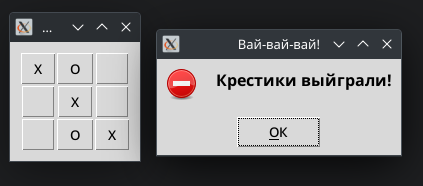

# Лабораторная работа №11
## Вариант 3
## Задача:
Написать крестики-нолики с использованием GUI-библиотеки.

## Решение:
Я выбрал Tkinter, т.к. он является встроенным в Python.

```python
from tkinter import *
from tkinter import messagebox as mb

class Game:
    player = 'O'
    def nextPlayer(self):
        if self.player == 'O':
            self.player = 'X'
        else:
            self.player = 'O'
        return self.player
    def alert(self, msg):
        mb.showerror(title = "Вай-вай-вай!", message = msg)
    def __init__(self):
        self.root = Tk(className='Лаб.11 крестики-нолики')
        self.frm = Frame(self.root, padx=10, pady=10)
        for x in (0,1,2):
            for y in (0,1,2):
                Button(self.frm, text='  ',
                       command=lambda x=x, y=y:
                           self.press(x,y)
                      ).grid(column=x, row=y)
    def press(self, x, y):
        #print(x,y)
        b = self.frm.grid_slaves(y, x)[0]
        if b.cget('text') != '  ':
            self.alert('Невозможный ход!')
            return
        b.config(text=self.nextPlayer())
        self.checkVictory()
    def checkVictory(self):
        def cell(x, y):
            return self.frm.grid_slaves(x, y)[0].cget('text')
        def check(cells):
            print(cells)
            if all([i=='O' for i in cells]):
                self.alert('Нолики выйграли!')
                self.root.destroy()
            elif all([i=='X' for i in cells]):
                self.alert('Крестики выйграли!')
                self.root.destroy()
        # прямые по горизонтали
        for y in (0,1,2):
            check([cell(x, y) for x in (0,1,2)])
        # прямые по вертикали
        for x in (0,1,2):
            check([cell(x, y) for y in (0,1,2)])
        # диагональ сверху-слева вправо-вниз
        check([cell(x, y) for x, y in ((0,0), (1,1), (2,2))])
        # диагональ справа-сверху влево-вниз
        check([cell(x, y) for x, y in ((2,0), (1,1), (0,2))])

if __name__ == '__main__':
    s = Game()
    s.frm.grid()
    s.root.mainloop()
```

Запускается стандартно, использует только встроенные модули


