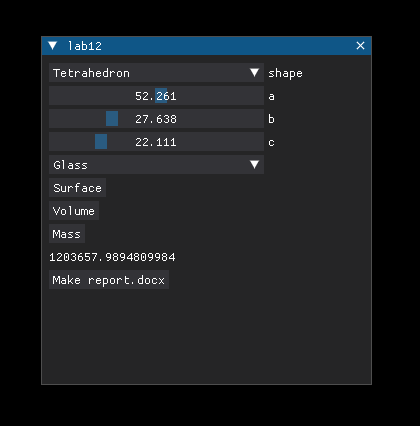

# Лабораторная работа №13 (вариант 3)
## Задание (основа):
По своему варианту задания и GUI фреймворка создайте пакет, содержащий 3 модуля, и подключите его к основной программе. Основная программа должна предоставлять:

### Геометрические тела (вариант 3)
- Параллелепипед
- Тетраэдр
- Шар

Расчёт объема, площади поверхности, массы в зависимости от материала.

Фреймворк: Kivy


Графический пользовательский интерфейс с возможностями ввода требуемых параметров и отображения результатов расчёта,
возможность сохранить результаты в отчёт формата .doc или .xls (например, пакеты python-docx и openpyxl).

## Запуск:

Вопрос: правильно ли так делать?

```sh
hatch run python src/lab13/__init__.py
```

## Скриншот

