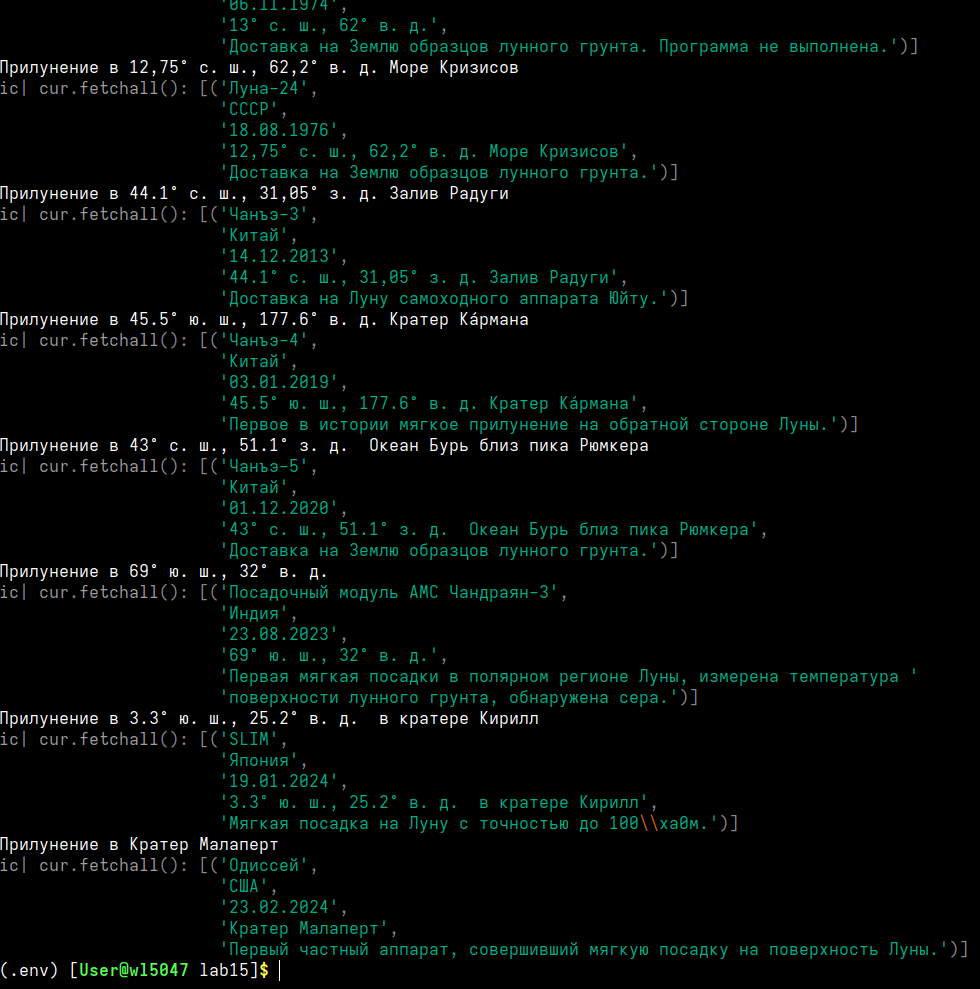

# Лабораторная работа №15
## Вариант 14%12 = 2
## Задача:
- Спроектируйте БД с использованием crow’s foot notation.
- Реализуйте парсер для сбора данных с веб-страницы.
- С помощью DB API cоздайте таблицы БД и заполните их данными, полученными с помощью парсера.
- Напишите запросы для выборки данных из БД.

[Список мягких посадок на Луну.](https://ru.wikipedia.org/wiki/%D0%A1%D0%BF%D0%B8%D1%81%D0%BE%D0%BA_%D0%BF%D1%80%D0%B8%D0%BB%D1%83%D0%BD%D0%B5%D0%BD%D0%B8%D0%B9#%D0%A1%D0%BF%D0%B8%D1%81%D0%BE%D0%BA_%D0%BC%D1%8F%D0%B3%D0%BA%D0%B8%D1%85_%D0%BF%D0%BE%D1%81%D0%B0%D0%B4%D0%BE%D0%BA)

Таблицы:

    космические аппараты
    страны
    места прилунений

Запросы:

    топ N стран по числу прилунений
    прилунения с группировкой по странам
    прилунения с группировкой по местам

## Скриншот
