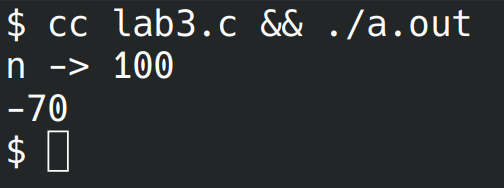

# Лабораторная работа №3
## Вариант 3
## Задание
1. Напишите программу по своему варианту.
2. Оформите отчёт в README.md. Отчёт должен содержать:
- Задание
- Описание проделанной работы
- Скриншоты результатов
- Ссылки на используемые материалы

Задание по варианту:
- Найти три максимума в массиве и записать разность их произведения и суммы их индексов по модулю $n$, где $n$ - количество элементов массива.

## Требования и ограничения
Количество элементов массива вводить с клавиатуры, массив заполнить случайными числами. Необходимые расчёты и модификации реализовать в виде функций.

## Проделанная работа
1. Написан файл "lab.c" (вдохновлён IOCCC):
```c
#include <stdio.h>
#include <stdlib.h>
#include <time.h>

void fill(int n, int a[]) {
    for (int i = 0; i < n; ++i)
        a[i] = rand() % 101 - 50;
}

int compute(int n, int A[n]) {
    /* Найдём 3 максимума и их индексы */
    int M[3] = {0}, I[3];
    for(int i = 0; i < n; ++i) {
        if(A[i] > *M) {
            *M = A[i];
            *I = i;
        }
    }
    for(int i = 0; i < n; ++i) {
        if(i == *I) {
            ++i;
            if(i >= n) break;
        }
        if(A[i] > 1[M]) {
            *(1+M) = A[i];
            1[I] = i;
        }
    }
    for(int i = 0; i < n; ++i) {
        if(i == *I || i == *(1+I)) {
            ++i;
            if(i >= n) break;
        }
        if(i[A] > 2[M]) {
            *(2+M) = A[i];
            2[I] = i;
        }
    }
    return *M*1[M]*2[M] - ((*I+1[I]+2[I]) % n);
}

int main() {
    srand(time(NULL));
    int n;
    printf("n -> ");
    scanf("%d", &n);
    int A[n];
    fill(n, A);

    printf("%i\n", compute(n, A));
    return 0;
}
```
2. Скомпилирован и запущен
3. Сделан скриншот:



## Ссылки на используемые материалы
https://evil-teacher.on.fleek.co/prog_pm/term1/lab03/
