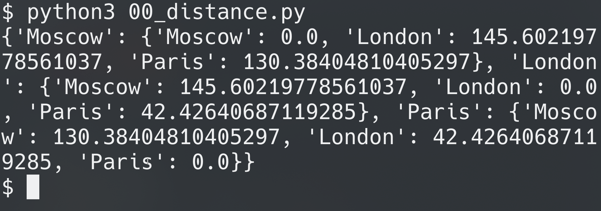
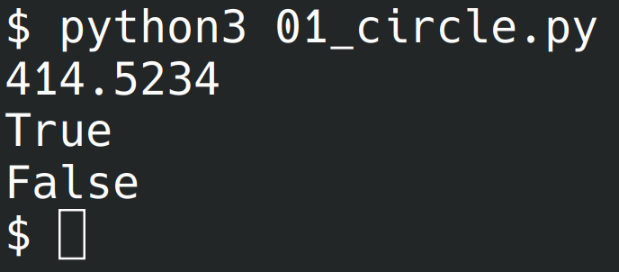

# Лабораторная работа №4
## 00
Составить словарь словарей расстояний между городами

## 01
Вычислить площадь круга. Вывести на экран с точностью 4 знака после запятой. Вывести, входят ли точки в круг (2 точки)

