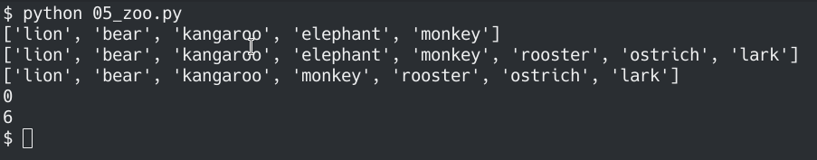
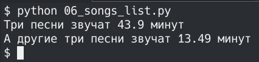
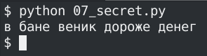
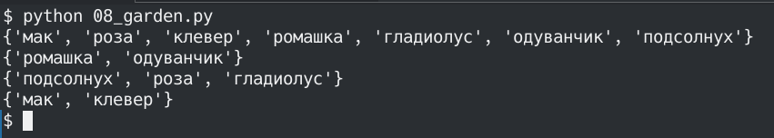
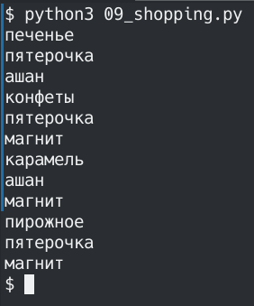
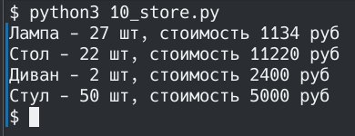

# Лабораторная работа №4
## 00
Составить словарь словарей расстояний между городами


## 01
Вычислить площадь круга. Вывести на экран с точностью 4 знака после запятой. Вывести, входят ли точки в круг (2 точки)


## 02
Расставьте знаки операций "плюс", "минус", "умножение" и скобки между числами "1 2 3 4 5" так, что бы получилось число "25"


## 03
Выведите на консоль с помощью индексации строки, последовательно:
- первый фильм
- последний
- второй
- второй с конца


## 04
Создать списки членов семьи и их роста. Вывести рост отца и сумму роста членов семьи


## 05
- есть список животных в зоопарке
- zoo = ['lion', 'kangaroo', 'elephant', 'monkey', ]
- посадите медведя (bear) между львом и кенгуру
- и выведите список на консоль
- добавьте птиц из списка birds в последние клетки зоопарка
- и выведите список на консоль
- уберите слона
- и выведите список на консоль
- выведите на консоль в какой клетке сидит лев (lion) и жаворонок (lark).
- Номера при выводе должны быть понятны простому человеку, не программисту.



## 06

- Есть список песен группы Depeche Mode со временем звучания с точностью до долей минут
- Точность указывается в функции round(a, b), где a это число которое надо округлить, а b количество знаков после запятой
```python
violator_songs_list = [
    ['World in My Eyes', 4.86],
    ['Sweetest Perfection', 4.43],
    ['Personal Jesus', 4.56],
    ['Halo', 4.9],
    ['Waiting for the Night', 6.07],
    ['Enjoy the Silence', 4.20],
    ['Policy of Truth', 4.76],
    ['Blue Dress', 4.29],
    ['Clean', 5.83],
]
```
- распечатайте общее время звучания трех песен: 'Halo', 'Enjoy the Silence' и 'Clean' в формате "Три песни звучат ХХХ.XX минут"
- Есть словарь песен группы Depeche Mode
```python
violator_songs_dict = {
    'World in My Eyes': 4.76,
    'Sweetest Perfection': 4.43,
    'Personal Jesus': 4.56,
    'Halo': 4.30,
    'Waiting for the Night': 6.07,
    'Enjoy the Silence': 4.6,
    'Policy of Truth': 4.88,
    'Blue Dress': 4.18,
    'Clean': 5.68,
}
```
- распечатайте общее время звучания трех песен: 'Sweetest Perfection', 'Policy of Truth' и 'Blue Dress': "А другие три песни звучат ХХХ минут"



## 07

- Есть зашифрованное сообщение
```python
secret_message = [
    'квевтфпп6щ3стмзалтнмаршгб5длгуча',
    'дьсеы6лц2бане4т64ь4б3ущея6втщл6б',
    'т3пплвце1н3и2кд4лы12чф1ап3бкычаь',
    'ьд5фму3ежородт9г686буиимыкучшсал',
    'бсц59мегщ2лятьаьгенедыв9фк9ехб1а',
]
```
- Нужно его расшифровать и вывести на консоль в удобочитаемом виде.



## 08
```python
# в саду сорвали цветы
garden = ('ромашка', 'роза', 'одуванчик', 'ромашка', 'гладиолус', 'подсолнух', 'роза', )

# на лугу сорвали цветы
meadow = ('клевер', 'одуванчик', 'ромашка', 'клевер', 'мак', 'одуванчик', 'ромашка', )

# создайте множество цветов, произрастающих в саду и на лугу
# выведите на консоль все виды цветов
# выведите на консоль те, которые растут и там и там
# выведите на консоль те, которые растут в саду, но не растут на лугу
# выведите на консоль те, которые растут на лугу, но не растут в саду
```



## 09
```python
# Есть словарь магазинов с распродажами

shops = {
    'ашан':
        [
            {'name': 'печенье', 'price': 10.99},
            {'name': 'конфеты', 'price': 34.99},
            {'name': 'карамель', 'price': 45.99},
            {'name': 'пирожное', 'price': 67.99}
        ],
    'пятерочка':
        [
            {'name': 'печенье', 'price': 9.99},
            {'name': 'конфеты', 'price': 32.99},
            {'name': 'карамель', 'price': 46.99},
            {'name': 'пирожное', 'price': 59.99}
        ],
    'магнит':
        [
            {'name': 'печенье', 'price': 11.99},
            {'name': 'конфеты', 'price': 30.99},
            {'name': 'карамель', 'price': 41.99},
            {'name': 'пирожное', 'price': 62.99}
        ],
}

# Создайте словарь цен на продкты следующего вида (писать прямо в коде)
sweets = {
    'название сладости': [
        {'shop': 'название магазина', 'price': 99.99},
        # TODO тут с клавиатуры введите магазины и цены (можно копипастить ;)
    ],
    # TODO тут с клавиатуры введите другую сладость и далее словарь магазинов
}
# Указать надо только по 2 магазина с минимальными ценами
```



## 10

```python
# Есть словарь кодов товаров

goods = {
    'Лампа': '12345',
    'Стол': '23456',
    'Диван': '34567',
    'Стул': '45678',
}

# Есть словарь списков количества товаров на складе.

store = {
    '12345': [
        {'quantity': 27, 'price': 42},
    ],
    '23456': [
        {'quantity': 22, 'price': 510},
        {'quantity': 32, 'price': 520},
    ],
    '34567': [
        {'quantity': 2, 'price': 1200},
        {'quantity': 1, 'price': 1150},
    ],
    '45678': [
        {'quantity': 50, 'price': 100},
        {'quantity': 12, 'price': 95},
        {'quantity': 43, 'price': 97},
    ],
}

# Рассчитать на какую сумму лежит каждого товара на складе
# например для ламп

lamps_cost = store[goods['Лампа']][0]['quantity'] * store[goods['Лампа']][0]['price']
# или проще (/сложнее ?)
lamp_code = goods['Лампа']
lamps_item = store[lamp_code][0]
lamps_quantity = lamps_item['quantity']
lamps_price = lamps_item['price']
lamps_cost = lamps_quantity * lamps_price
print('Лампа -', lamps_quantity, 'шт, стоимость', lamps_cost, 'руб')

# Вывести стоимость каждого вида товара на складе:
# один раз распечать сколько всего столов и их общая стоимость,
# один раз распечать сколько всего стульев и их общая стоимость,
#   и т.д. на складе
# Формат строки <товар> - <кол-во> шт, стоимость <общая стоимость> руб

# WARNING для знающих циклы: БЕЗ циклов. Да, с переменными; да, неэффективно; да, копипаста.
# Это задание на ручное вычисление - что бы потом понять как работают циклы и насколько с ними проще жить.
```


