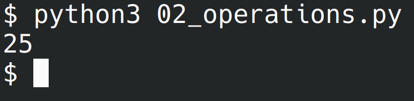
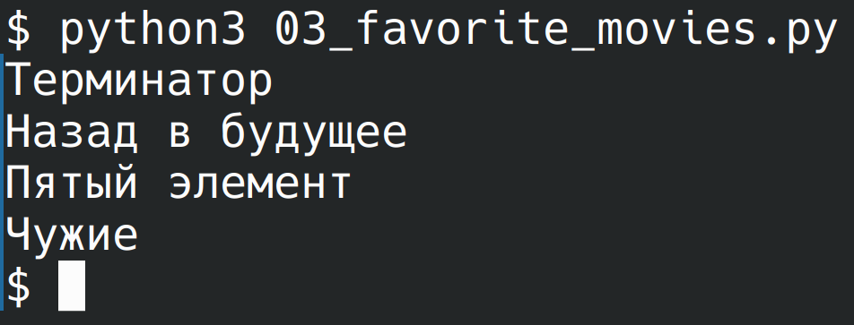
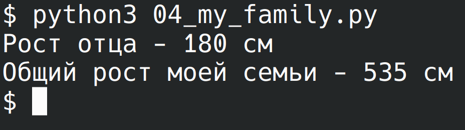

# Лабораторная работа №4
## 00
Составить словарь словарей расстояний между городами

## 01
Вычислить площадь круга. Вывести на экран с точностью 4 знака после запятой. Вывести, входят ли точки в круг (2 точки)

## 02
Расставьте знаки операций "плюс", "минус", "умножение" и скобки между числами "1 2 3 4 5" так, что бы получилось число "25"

## 03
Выведите на консоль с помощью индексации строки, последовательно:
- первый фильм
- последний
- второй
- второй с конца

## 04
Создать списки членов семьи и их роста. Вывести рост отца и сумму роста членов семьи

