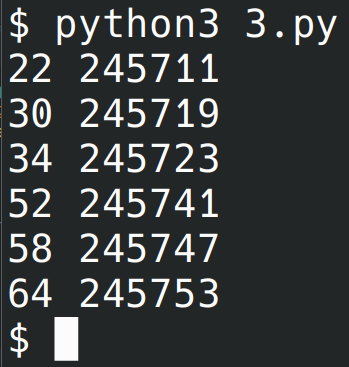

# Лабораторная работа №6
## Вариант 3

### Задача 1
Андрей составляет 6-буквенные коды из букв А, Н, Д, Р, Е, Й. Буква Й может использоваться в коде не более одного раза, при этом она не может стоять на первом месте, на последнем месте и рядом с буквой Е. Все остальные буквы могут встречаться произвольное количество раз или не встречаться совсем. Сколько различных кодов может составить Андрей?

Решение:
```python
from itertools import *

l = ['А', 'Н', 'Д', 'Р', 'Е', 'Й']
def p(x):
    if x[0] == 'Й': return False
    if x[-1] == 'Й': return False
    if x.count('Й') > 1: return False
    s = ''.join(x)
    return s.count('ЕЙ') + s.count('ЙЕ') == 0

print(len(list(filter(p, product(l, repeat=6)))))
```
Ответ: 23625

### Задача 2
Сколько единиц содержится в двоичной записи значения выражения $8^{2020}+4^{2017}+26-1$?

```python
x = 8**2020+4**2017+26-1
print(bin(x).count('1'))
```
Ответ: 5

### Задача 3
Найдите среди целых чисел, принадлежащих числовому отрезку $[245 690; 245 756]$ простые числа. Выведите на экран все найденные простые числа в порядке возрастания, слева от каждого числа выведите его порядковый номер в последовательности. Каждая пара чисел должна быть выведена в отдельной строке. Например, в диапазоне $[5; 9]$ ровно два различных натуральных простых числа — это числа 5 и 7, поэтому для этого диапазона вывод на экран должен содержать следующие значения:

1 5

3 7

```python
def isPrime(x):
    if x == 1: return False
    for i in range(2,x//2+1):
        if x % i == 0: return False
    return True

# для проверки
#for i in range(1,100):
#    if(isPrime(i)): print(i)
#f = 5
#t = 9

f = 245_690
t = 245_756
for i in filter(isPrime, range(f, t)):
    print(i-f+1, i)
```
Ответ:


