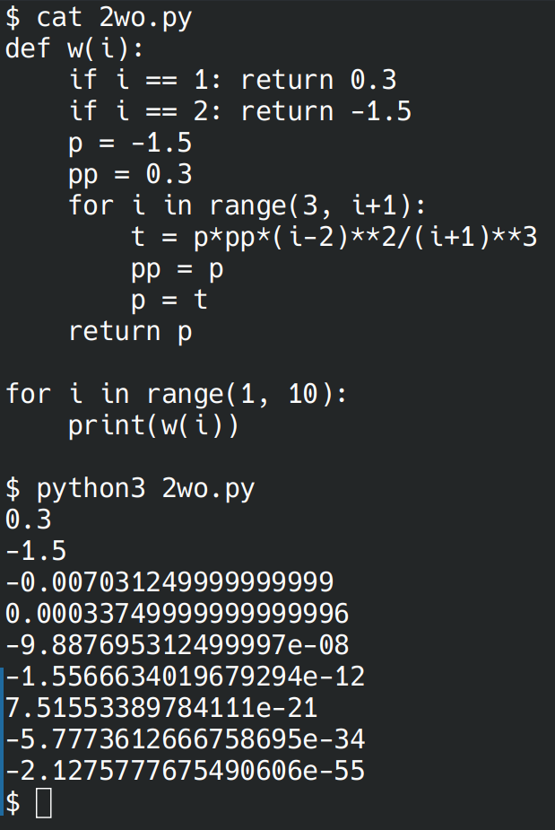

# Лабораторная работа №7
## Вариант 3
### Задача 1:
Функция для распаковки списка, содержащего другие объекты (`int`, `str`, `list`, `tuple`, `dict`, `set`) произвольной вложенности.
```python
>>> unpack([None, [1, ({2, 3}, {'foo': 'bar'})]])
[None, 1, 2, 3, 'foo', 'bar']
```

#### С рекурсией
```python
from itertools import chain
def unpack(x):
    def f(z):
        if type(z) == list:
            return list(chain.from_iterable([f(i) for i in z]))
        return [z]
    match type(x).__name__:
        case 'list' | 'tuple' | 'set':
            return f([unpack(i) for i in x])
        case 'dict':
            return [[unpack(i), unpack(x[i])] for i in x.keys()]
        case _:
            return x

print(unpack([None, [1, ({2, 3}, {'foo': 'bar'})]]))
```


#### Без рекурсии
```python
```


### Задача 2
Функция для расчёта $w_i=w_{i-1}w_{i-2}\frac{(i-1)^2}{(i+1)^3}$. $w_1=0.3,w_2=-1.5$.

#### С рекурсией
```python
```


#### Без рекурсии
```python
```

