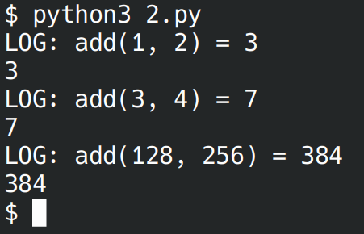

# Лабораторная работа №8
## Вариант 3

### Задача 1
Замыкание для получения очередной строки из файла.
```python
def line(fname):
    f = open(fname, 'r')
    return lambda: f.readline()

f = line('1.py')
print(f())
print(f())
print(f())
```


### Задача 2
Декоратор, который будет логировать вызовы функций.
```python
def log(f):
    def d(*args, **kwargs):
        r = f(*args, **kwargs)
        print('LOG:', f.__name__ + \
            '(' + str(args)[1:-1] + ') =', r)
        return r
    return d

def add(x, y): return x + y

f = log(add)
print(f(1, 2))
print(f(3, 4))
print(f(128, 256))
```


